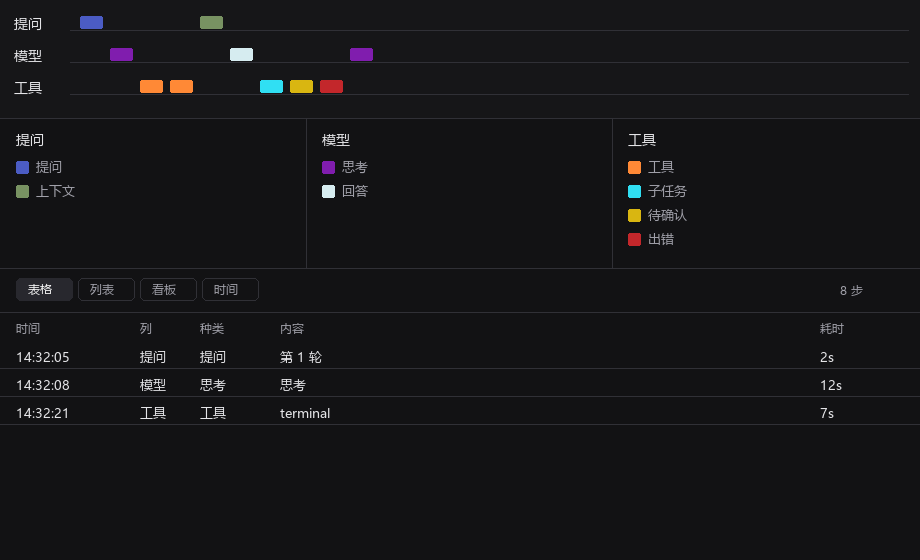
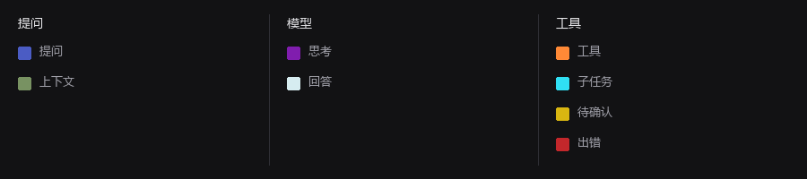

# hermes-trajectory

[中文说明](README.zh-CN.md)

A Hermes Desktop side pane that records one chat as a 3-lane trajectory: **Prompt / Model / Tools**.

Not a fake progress bar on the composer.



## Install

Put `plugin.js` here (folder name must equal plugin id `harness-progress`):

```
%LOCALAPPDATA%\hermes\desktop-plugins\harness-progress\plugin.js
```

Command palette → **Reload desktop plugins**. Enable **Trajectory** in Settings → Plugins.

Works in any profile. Each profile and chat keeps its own layout and colors.

## Views

Switch anytime (choice is remembered):

| Table | List | Board | Time |
| --- | --- | --- | --- |
| Spreadsheet | Chronological cards | Three columns | Vertical timeline |

Click a row or a bar to lock the same step in the color axis and the list.

Time stamps show **time only today**, `MM-DD` on another day, `YYYY-MM-DD` in another year.

## Lanes

The three names stay **Prompt / Model / Tools**. Click a name to add or remove kinds in that column (context, todo, goal, background, compact, …).



Click a swatch to pick a color. Changes persist per chat and profile.

## Languages

Follows Hermes: **English, 简体中文, 繁體中文, 日本語, العربية**.  
Events store keys, so switching the app language updates the pane.

## Spec

One ESM file. Imports only `@hermes/plugin-sdk`, `react`, `react/jsx-runtime`. No build, no JSX syntax.

MIT.
